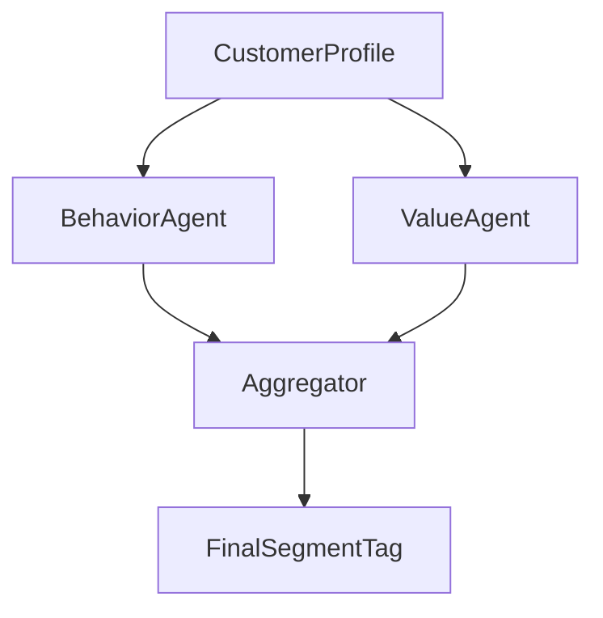

# Step-by-Step Setup for a Segmentation Agent in Agentverse

## 1. Define the Segmentation Objective

Clarify the purpose and expected output of the segmentation agent.

*   **What problem are you solving?** (e.g., targeted marketing, product bundling, key account identification)
*   **Who are you segmenting?** (e.g., customers, accounts, leads, partners)
*   **What type of segmentation?** (behavioral, business-based, etc.)
*   **What should the output look like?** (JSON segments, dashboard, labels in CRM)

---

## 2. Create a Segmentation Agent Shell in Agentverse

Use the Agentverse interface or CLI to scaffold an agent.

*   **Assign agent name:** e.g., `CustomerSegmentationAgent`
*   **Define agent role:** Segment customers by [criteria]
*   **Register input/output types:** e.g., input = customer profile, output = segment label
*   **Set trigger modes:** batch, event-driven (e.g., new customer, CRM update), or schedule (weekly)

---

## 3. Define Sub-Agent Taxonomy

Instantiate sub-agents based on segmentation logic.

**Example:**

```yaml
SegmentationAgent:
  subagents:
    - BehaviorSegmentationAgent
    - ValueSegmentationAgent
    - AffinitySegmentationAgent
    - GeoComplianceSegmentationAgent
```

Each sub-agent should:
*   Declare its **input schema**
*   Register relevant **data sources**
*   Output intermediate segmentation results

---

## 4. Integrate Data Sources

Connect to internal and external systems:

*   **CRM** (e.g., Salesforce Sales Cloud, Service Cloud)
*   **ERP** (for revenue, margin)
*   **Digital engagement platforms** (e.g., Marketing Cloud, Pardot)
*   **Support logs** (Zendesk, Intercom)
*   **Public databases** (LinkedIn, public company data)

Use Agentverse's `DataConnector` or `IntegrationAdapter` modules to pull in data.

**Ensure:**
*   ETL pipelines are in place
*   PII handling & compliance rules are enforced
*   Data is normalized and unified into a **customer profile object**

---

## 5. Implement Segmentation Logic

For each sub-agent, define the logic (rule-based, ML-based, hybrid).

**Example: For `BehaviorSegmentationAgent`**
*   Load historical interaction data
*   Use clustering (e.g., K-means, DBSCAN) or rules (RFM analysis)
*   Label segments: `HighEngaged`, `Dormant`, `NewVisitor`

**Tools:**
*   Agentverse supports Python, SQL, or prompt-based logic (LLM agents).
*   Optionally integrate ML pipelines (e.g., via VertexAI, SageMaker, Sklearn models)

---

## 6. Orchestrate Sub-Agent Coordination

Use Agentverse's orchestration features:

*   Define the **execution order** of sub-agents (e.g., behavior before value-based).
*   Set **data passing rules** (e.g., all results combined, majority voting).
*   Aggregate results into a final segment label or multi-tag profile.

**Example orchestration DAG:**



---

## 7. Output Handling & Routing

Define what happens with the segmentation output:

*   Write back to CRM or Customer360 store.
*   Push to marketing automation platforms.
*   Feed dashboards (PowerBI, Looker).
*   Trigger downstream agents (e.g., RecommendationAgent, RetentionAgent).

---

## 8. Monitoring & Evaluation

Set up:

*   **Agent health checks:** input/output validation, sub-agent failures.
*   **Segment drift detection:** alert if clusters shift significantly.
*   **Feedback loop:** allow sales/marketing to correct or confirm segments.

Add telemetry via `AgentObserver` or `SegmentAuditAgent`.

---

## 9. Continuous Learning (Optional)

Enable learning mode:

*   Store labeled data from human feedback.
*   Retrain ML models periodically.
*   Use reinforcement signals (e.g., campaign success, product adoption) to optimize segmentation logic.

---

## 10. Governance & Compliance

*   Register agent with the **AI governance layer**.
*   Tag data usage: PII, GDPR classifications.
*   Version all logic/models and segment definitions.
*   Implement access controls: Who can run, view, or override segments?

---

## ⚠️ Common Pitfalls in Setup

*   **Too many segment categories** → leads to indecision or misaligned messaging.
*   **Overfitting early on sparse data** → causes unstable segments.
*   **Ignoring organizational feedback loop** (e.g., reps rejecting segment labels).
*   **Misaligned agent goals vs business outcomes** (e.g., optimized for revenue, but used for support routing).